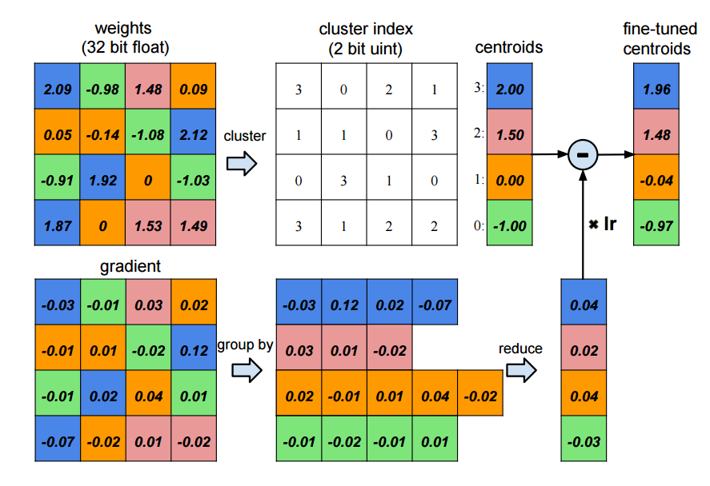
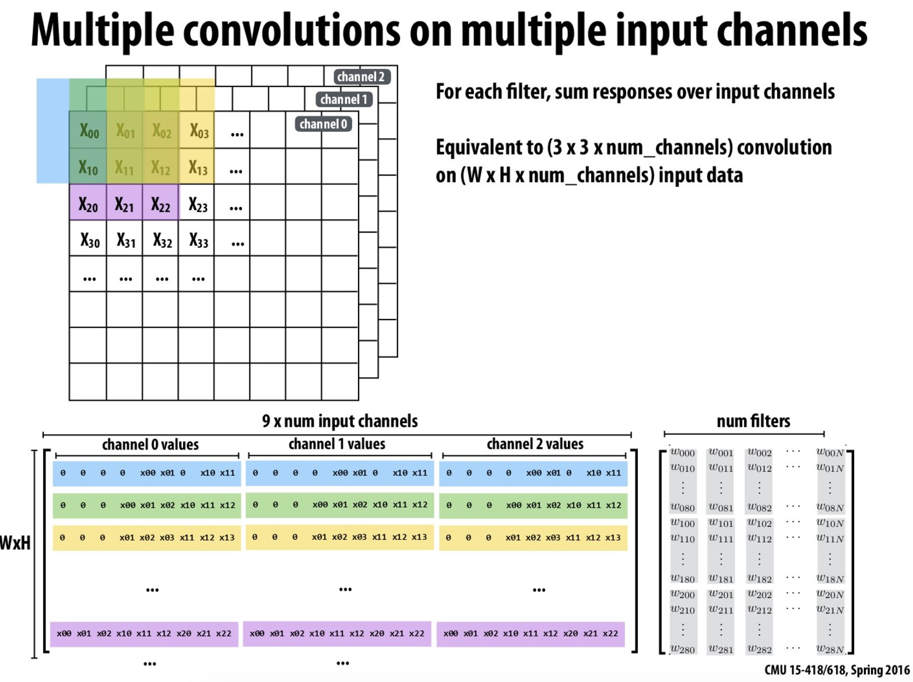
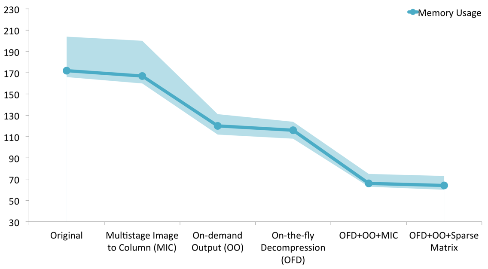
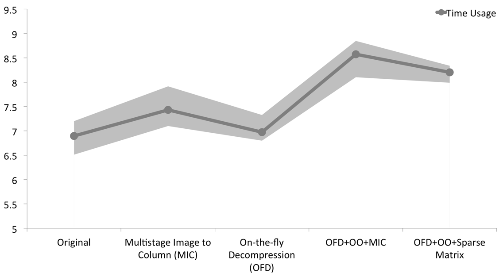

<style>sup:before { content: "["; }sup:after { content: "]"; }</style>

<a href="https://github.com/codinfox/espresso" title="Fork me on Github" class="github-corner"><svg width="80" height="80" viewBox="0 0 250 250" style="fill:#151513; color:#fff; position: fixed; top: 0; border: 0; right: 0;"><path d="M0,0 L115,115 L130,115 L142,142 L250,250 L250,0 Z"></path><path d="M128.3,109.0 C113.8,99.7 119.0,89.6 119.0,89.6 C122.0,82.7 120.5,78.6 120.5,78.6 C119.2,72.0 123.4,76.3 123.4,76.3 C127.3,80.9 125.5,87.3 125.5,87.3 C122.9,97.6 130.6,101.9 134.4,103.2" fill="currentColor" style="transform-origin: 130px 106px;" class="octo-arm"></path><path d="M115.0,115.0 C114.9,115.1 118.7,116.5 119.8,115.4 L133.7,101.6 C136.9,99.2 139.9,98.4 142.2,98.6 C133.8,88.0 127.5,74.4 143.8,58.0 C148.5,53.4 154.0,51.2 159.7,51.0 C160.3,49.4 163.2,43.6 171.4,40.1 C171.4,40.1 176.1,42.5 178.8,56.2 C183.1,58.6 187.2,61.8 190.9,65.4 C194.5,69.0 197.7,73.2 200.1,77.6 C213.8,80.2 216.3,84.9 216.3,84.9 C212.7,93.1 206.9,96.0 205.4,96.6 C205.1,102.4 203.0,107.8 198.3,112.5 C181.9,128.9 168.3,122.5 157.7,114.1 C157.9,116.9 156.7,120.9 152.7,124.9 L141.0,136.5 C139.8,137.7 141.6,141.9 141.8,141.8 Z" fill="currentColor" class="octo-body"></path></svg></a><style>.github-corner:hover .octo-arm{animation:octocat-wave 560ms ease-in-out}@keyframes octocat-wave{0%,100%{transform:rotate(0)}20%,60%{transform:rotate(-25deg)}40%,80%{transform:rotate(10deg)}}@media (max-width:500px){.github-corner:hover .octo-arm{animation:none}.github-corner .octo-arm{animation:octocat-wave 560ms ease-in-out}}</style>

# Espresso <i class="fa fa-coffee"></i>

## A minimal high performance parallel neural network framework running on iOS

**[Zhihao Li](http://codinfox.github.io/)** (zhihaol) and **[Zhenrui Zhang](http://jerryzh168.github.io/)** (zhenruiz)

<style>a.nav { color: #585858; border-radius: 5px; background: #E6E6E6; padding: .2em .7em; text-decoration: none; margin: 0 .5em; }a.nav:hover { background: #D8D8D8; color: black;}a.nav.selected { background: #D8D8D8; font-weight: bold; }small{color: #5e5e5e; display:block;text-align:center;margin-bottom: 1em;}</style>
<div style="text-align: center;"><a class="nav selected" href="http://codinfox.github.io/espresso/proposal" target="_blank">Final Report</a> <a class="nav" href="http://codinfox.github.io/espresso/proposal" target="_blank">Proposal</a> <a class="nav"  href="http://codinfox.github.io/espresso/checkpoint" target="_blank">Checkpoint Report</a></div>

### Overview

We developed a parallel neural network framework running well on iOS devices regardless of the limited memory and computing resources. Our framework features low memory footprint and high parallelism. By extensively using **CPU SIMD operations**, **GPU acceleration**, **on-demand output**, **on-the-fly network decompression** and many other techniques, one can evaluate networks as deep as 60+ layers or as large as AlexNet[^9] with ease.

With above mentioned techniques, we are able to **shrink the peak memory usage to 35% of original network**, and get **~250x speedup over our naive implementation** (also the implementation used by [other implementation of neural network framework](https://github.com/alexsosn/ConvNetSwift.git)). Besides those numbers, our framework is also well designed and easy to use.

<div style="text-align: center;"><iframe width="560" height="315" src="https://www.youtube.com/embed/uBqwVKA_SZQ" frameborder="0" allowfullscreen></iframe></div>

### Background

According to Morgan Stanley Research, as of the year of 2011, half of the computing devices worldwide are mobile devices [^6]. The intelligent mobile applications are changing people's lives. However after a quite thorough survey, we find no fully functional deep neural network framework on iOS. Therefore, we want to implement our own.

This framework features ***well designed and easy to use API***, and ***high performance parallel neural network implementation*** based on Accelerate framework and Metal.

With such framework, software engineers can easily deploy network on their iOS devices. This can potentially lead to many interesting applications. For example, an application that can recognize daily objects ***in almost real time without connection to internet***. We envision a great future market opening for such framework.

However, the task of training and running neural networks on a iOS device is challenging.

* **Memory Limitation** The latest version of iPhone (iPhone 6S) has only 2 GB RAM. This makes running a network on such device very difficult, not to mention training on it. To compensate this issue, we may take advantage of recent research outgrowth on compression of deep neural networks [^1] [^2] [^3] [^8].
* **High Performance Computing** Parallelizing a neural network implementation on iOS devices is an unprecedented task. We will explore the possibility of Metal API to implement a GPGPU version of the framework and Accelerate framework for CPU version.

Baring these challenges, in this project, we attempt to solve these issues and make a usable framework.

### Our Approach

#### Addressing Memory Constraint

Most networks contain millions of weights, making them super large and infeasible to be run on mobile devices. To address this issue, we applied three methods:


<small>Representing the matrix sparsity with relative index</small>


<small>Weight sharing by scalar quntization and centroids fine-tuning</small>

1. **Deep Compression**: besides normal full-sized networks, our framework also supports networks compressed with deep compression algorithm [^2]. By using pruning, trained quntization, deep compression algorithm can compress AlexNet from 200M+ to only 8M. This significantly reduces the amount of data we need read into memory. The method is shown in the above 2 figures.
2. **On-the-fly Decompression**: if we decompress the whole compressed network, then the problem degrade back to the big network problem - the weights still cannot fit into memory. Therefore, we decompress the weights on the fly: when the memory is sufficient for containing the whole network, then all the weights are stored in the network; if the memory is limited, then the weights are decompressed on the fly only when it is needed. With this strategy, we manage to fit the whole AlexNet (200M+ weights, 1GB+ runtime memory usage without compression)
3. **On-demand Outputs**: not all the outputs are needed all the time. Therefore, we only keep outputs when they are needed in the network architecture. Otherwise, we purge the memory of the outputs. In case of training (which we don't currently support yet), we can save the outputs to flash disk. This is a performance-memory usage trade off.
4. **Multistage Image to Column**: this will be covered in the next section.

#### Performance Optimizations



1. **`Image to Column`(im2col) in Convolution Layer**: In our naive implementation, we used the common 7 for loops to implement convolution layer to keep the memory usage low. However, it turns out that the performance suffers a lot without `im2col`. The original implementation takes about 30 minutes to evaluate a `SqueezeNet`, while the version using `im2col` and Accelerate framework for matrix multiplication takes only 7 seconds, yielding a ~250x speedup. Our implementation of `im2col` also fully utilized the spacial locality in the operation. The `im2col` operation expands the image to multiple small vectors, each vector corresponds to the values of the image pixels when the convolution is performed. The above figure is a slide from 15-418/618 course website. There is not much spacial locality to exploit in each row, since the kernelSize is typically small(3 is a common choice). However, if we look at the column of the result matrix, the ajacent pixels in result matrix are the pixels with the same index in the kernel window for ajacent convolution operations, which are almost consequtive in the original image matrix, or ajacent if the stride is 1. Therefore, if we fill the matrix column by column, we'll have great spacial locality in reading the original matrix. To further improve the locality of the output matrix, we will produce a matrix that is a transpose of the matrix shown in the slide instead. This way, we can have the best spatial locality both in input matrix and in output matrix.
2. **Multi-stage Image to Column** `im2col` introduces memory overhead since the original image is inflated by a factor of (numInputChannels * kernelSize ^ 2). We don't want this optimization to negatively affect the memory efficiency, since memory efficiency is what enables us to run networks that can not be run in mobile devices before. According to the algorithm, the result of `im2col` only depend on the original image and the kernel size, and there is no dependency between different input channels. A even more interesting observation is that the pixel values in different channels are exactly the same. This means we can maintain one copy of the `im2col` result for all the channels, perform the matrix multiplication with the kernel weights in one channel and reuse the result in the next channel until all the input channels are exhausted. The intermediate result can be consumed immediately by summing into the output matrix. Therefore, we can reduce the memory usage by a factor of (numInputChannels) in memory constraint situations.
3. **Other optimizations using Accelerate Framework** The accelerate framework is our interface to access the SIMD feature provided in Swift, to fully utilize the feature, we also apply the APIs in accelerate framework when appropriate(specifically, use matrix multiplications instead of for loops).

### Current Result

#### Memory Usage


<small>Memory usage with different techniques. The experiment is done with SqueezeNet [^8]. The band shows the maximum and minimum memory usage and the solid line shows the average memory usage. The runtime memory usage of original network is 172M, while after applying all the techniques, we manage to shrink it to 66M</small>

We performed analysis on the SqueezeNet. The result comes from 10 repeated trails. We can see that after applying OFD, OO and MIC, we manage to shrink the runtime memory usage to 66M.

A trade-off needs to be made is the performance. Since we spend some time on optimizing for memory usage, the performance suffers a little.


<small>Memory usage with different techniques. The experiment is done with SqueezeNet [^8]. The band shows the maximum and minimum time usage and the solid line shows the average time usage. It shows the time taken for one forward through the whole network. Result is got from 10 repeated trails.</small>

We also did a run time recording on the AlexNet.


<small>Runtime memory analysis on AlexNet</small>

We can see the peak memory usage is 327.3M, which is significantly lower than 1.3G (when running without any memory optimization). The plateau is when it goes through the fully connected layer, which contains most of the weights of the network.

#### Performance(CPU)

250x speedup with respect to the navie implementation.

The following table is the running time of evaluting 3 networks in our framework.

|   Network   | Naive | Optimized | GPU Optimized |
|:---------:|:-------------------:|:-----:|:-------:|
| `SqueezeNet`(31M) |~1800s| 7.8s |~5s|
| `AlexNet` (233M) | / |  6.9s |/|
|`MNIST`(11M)| / |0.024s |/|

Although `AlexNet` has much more parameters(200M model file) than `SqueezeNet`(30M model file), the evaluation time is still less than `SqueezeNet`, one difference between the two network is that `SqueezeNet` has a lot more layers than `AlexNet`, which means the inherent sequential part of the computation is potentially larger since our implementation enforces strict dependencies between layers(The layers are topologically sorted according to dependency in construction time). The same argument applies for the running time of `MNIST` since it has far shallower networks.

#### Performance(GPU)

Our GPU version is implemented using the Metal API and the naive implementation of the GPU version is a bit faster than the optimized CPU version. We'll post more analysis of GPU results when they are ready.

### Deliverables 

In this project, we want to developed a Caffe-like deep neural network framework running on iOS/OSX devices, in both CPU and GPU, that provides usable primitives to

* Define a neural netowrk
* Read in a network
* Run compressed models
* Run normal models

To achieve this, we implemented

* `ImageData` layer
* `Convolution` layer
* `ReLU` layer
* `FullyConnected` layer
* `Softmax` layer: as output layer, no BP needed
* `Pooling` layer: max pooling, average pooling, global pooling
* `Concat` layer
* `LRN` layer

#### Code Example

An example of using our framework to define, import and evaluate the `SqueezeNet` is shown below.

```swift
     /* Our network support neural networks in
       Directed Acyclic Graph (DAG) structure */
    network = Network(parameters: 
                NetworkProperties(batchSize: 1, engine: .CPU))
    /* The image data layer
      user need to define a readImage function */
    network.add(ImageDataLayer(parameters: ImageDataParameters(
      name: "data",
      imgNames: Array<String>(count: 100, repeatedValue: ""),
      dimensions: [1,3,227,227],
      dependencies: [],
      readImage: { _ in (self.readUIImageToTensor().storage, [0])}
      )))
    /* Add a convolution layer with parameters and dependencies 
       on the last layer */
    network.add(ConvolutionLayer(parameters: ConvolutionParameters(
      name: "conv1",
      dependencies: ["data"],
      numOutput: 96,
      kernelSize: 7,
      stride: 2
      )))
    ...
    /* Add a max pooling layer with dependency on the last layer */
    network.add(PoolingLayer(parameters: PoolingParameters(
      name: "pool1",
      dependencies: ["relu_conv1"],
      kernelSize: 3,
      stride: 2,
      method: .MAX
      )))
    ...
    /* Softmax layer */
    network.add(SoftmaxLayer(parameters: SoftmaxParameters(
      name: "prob",
      dependencies: ["pool10"]
      )))

    /* Import model */
    self.network.importFromFile(filename)

    /* Evaluating the network */
    let out = self.network.forward().storage

    let prob = out.maxElement()
    /* The index of the label with largest probability */
    let index = out.indexOf(prob!)
```

#### Demo
Shown in the **Overview** section.

### Future Direction

In the next few days, we'll still be working on the project. We are working to optimize our framework so that we can run `AlexNet` in realtime.

### Acknowledgement

We would like to thank Prof. Kayvon for providing iOS developer certificate.

##### References:

[^1]: Kim, Yong-Deok, et al. "Compression of Deep Convolutional Neural Networks for Fast and Low Power Mobile Applications." *arXiv preprint arXiv:1511.06530* (2015).

[^2]: Han, Song, Huizi Mao, and William J. Dally. "A deep neural network compression pipeline: Pruning, quantization, huffman encoding." *arXiv preprint arXiv:1510.00149* (2015).

[^3]: Chen, Wenlin, et al. "Compressing neural networks with the hashing trick." *arXiv preprint arXiv:1504.04788* (2015).

[^4]: Courbariaux, Matthieu, Yoshua Bengio, and Jean-Pierre David. "Low precision arithmetic for deep learning." *arXiv preprint arXiv:1412.7024* (2014).

[^5]: Gupta, Suyog, et al. "Deep learning with limited numerical precision." *arXiv preprint arXiv:1502.02551* (2015).

[^6]: Huberty, K., Lipacis, C. M., Holt, A., Gelblum, E., Devitt, S., Swinburne, B., ... & Chen, G. (2011). Tablet Demand and Disruption. *Tablet*.

[^7]: Jia, Yangqing, et al. "Caffe: Convolutional architecture for fast feature embedding." *Proceedings of the ACM International Conference on Multimedia. ACM*, 2014.

[^8]: Iandola, Forrest N., et al. "SqueezeNet: AlexNet-level accuracy with 50x fewer parameters and< 1MB model size." *arXiv preprint arXiv:1602.07360* (2016).

[^9]: Krizhevsky, Alex, Ilya Sutskever, and Geoffrey E. Hinton. "Imagenet classification with deep convolutional neural networks." *Advances in neural information processing systems*. 2012.
